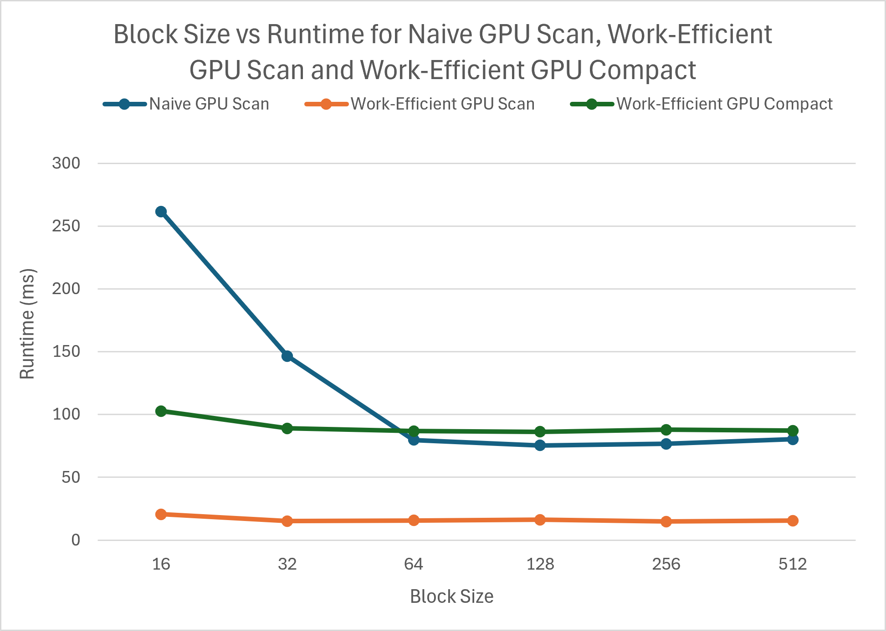
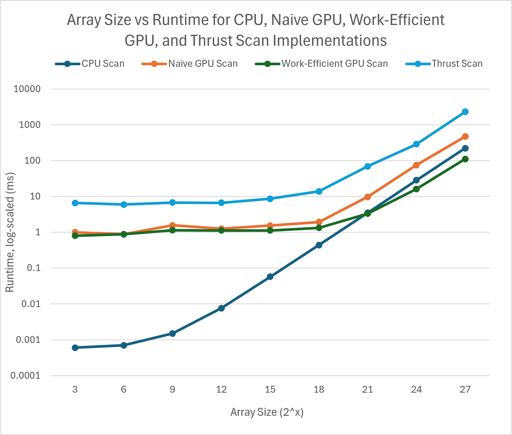
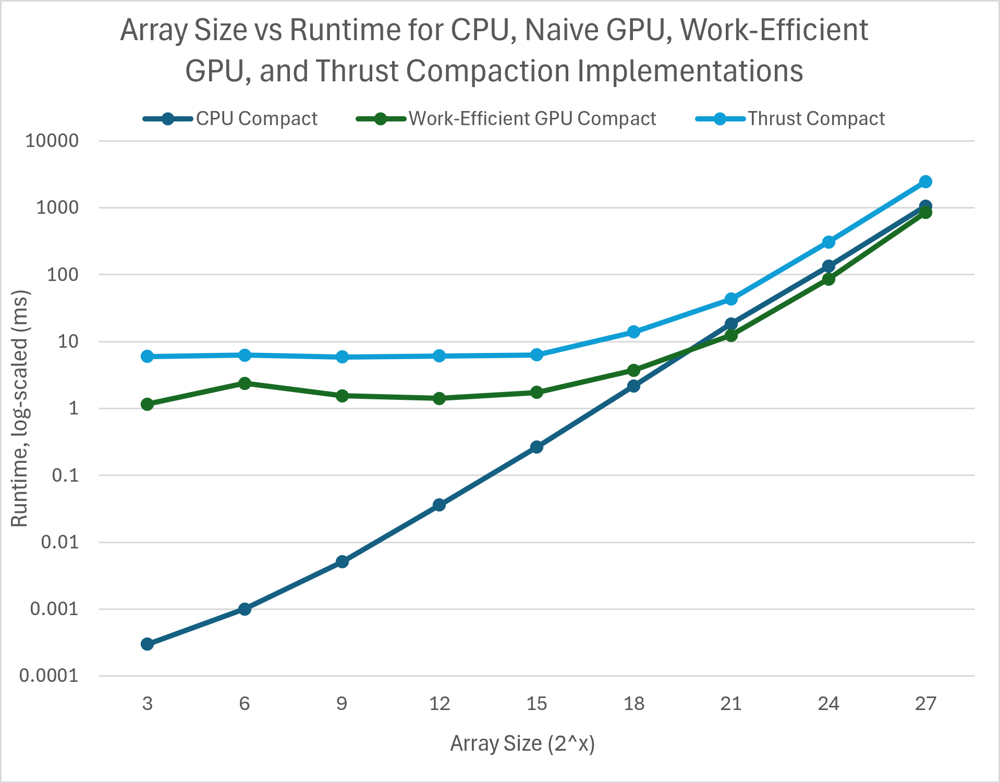

CUDA Stream Compaction
======================

**University of Pennsylvania, CIS 565: GPU Programming and Architecture, Project 2**

* Darrel Dsouza
* Tested on: Windows 11, i7-12700 @ 2.1GHz 32GB, NVIDIA T1000 4096MB (CETS Lab)

In Project 2, I implemented exclusive prefix sums scan and stream compaction, with one implementation on the CPU and multiple implementations on the GPU. The exclusive prefix scan returns an array where the value at each index of the array is the sum of all prior elements (exclusive of the element in the current index) of the input array. Stream compaction involves removing all zero valued entries from an array of integers and returning a compacted array consisting of only the non-zero integers from the original array.

These two algorithms, scan and compact, were implemented on: the CPU with runtime O(n), a naive implementation on the GPU with a runtime of O(nlogn), a work-efficient implementation on the GPU with runtime of O(n), and using the thrust library on the GPU.

##Performance Analysis

###Effect of Block Size on runtime for Naive Scan, Work-Efficient Scan, and Work-Efficient Compact
<p align="center">
  <br>
</p>

For this experiment, a standard array size of 2^24 elements was used and block size was varied from 16 to 512 by powers of 2.

Across all three algorithms, runtime drops significantly when moving from block size 16 to 64, but plateaus or slightly degrades past 128. Therefore, based on the data, the best overall execution performance sits at 128 threads per block.

Poor performance at low blocksize (<32) might be due to the fact that NVIDIA GPUs schedule and execute threads in groups of 32 (a warp). A block size of 16 utilizes only half of a warp, therefore half the threads in the warp are not being utilized, hence severely reducing efficiency.

###Effect of Array Size on runtime for CPU Scan, Naive Scan, Work-Efficient Scan, and Thrust Scan
<p align="center">
  <br>
</p>

For this experiment, array size was varied by powers of 2, from 2^3 (8 elements) to 2^27(~134 million elements) in increments of 2^3. Block size was kept constant at 128 for this test

For small $N$ ($2^3$ to $2^{12}$), CPU Scan finishes in under 0.0076 ms. All GPU implementations suffer from various overhead due to kernel invokation, memory allocation etc. Beyond $2^{18}$, the GPU implementations begin to outpace CPU processing, likely because at this point the runtime savings due to parallel execution begin to outweigh the time cost of GPU overhead. For large $N$ ($2^{21}$ to $2^{27}$), runtime of all algorithms begins to rise exponentially, with the Thust scan scaling the worst, then the Naive scan, due to its O(nlogn) time complexity. As n increases, cpu scan runtime will begin to overtake the GPU implementations. At the max array size tested of $2^{27}$, the work efficient GPU scan implementation predictably performs the best.


###Effect of Array Size on runtime for CPU Compact, Naive Compact, Work-Efficient Scan, and Thrust Scan
<p align="center">
  <br>
</p>

For this experiment, array size was varied by powers of 2, from 2^3 (8 elements) to 2^27(~134 million elements) in increments of 2^3. Block size was kept constant at 128 for this test. Runtime for CPU compact, Work-Efficient compact and Thrust compact was collected.

Similarly to the results for scan, as array size increases, initially CPU Compact has much lower runtime due to lower overhead than the GPU implementations. Around an array size of $2^{21}$, Work-Efficient GPU Compact begins to beat CPU compact with a faster runtime as array size increases.

### NSight Systems
Unfortunately, due to running on CETS lab computers where admin access is not available, I was unable to run NSight Systems for performance debugging.

## Test Program Output
Tests were added for Thrust Compact
```
****************
** SCAN TESTS **
****************
Generated array    [  27  14  16  15   1  39   7  36  15  38 ...  11   8  21   0 ]
Printed array==== cpu scan, power-of-two ====
   elapsed time: 28.4794ms    (std::chrono Measured)
    [   0  27  41  57  72  73 112 119 155 170 ... 410889810 410889821 410889829 410889850 ]
==== cpu scan, non-power-of-two ====
   elapsed time: 29.2435ms    (std::chrono Measured)
    [   0  27  41  57  72  73 112 119 155 170 ... 410889729 410889739 410889768 410889810 ]
    passed 
==== naive scan, power-of-two ====
   elapsed time: 261.669ms    (CUDA Measured)
    passed 
==== naive scan, non-power-of-two ====
   elapsed time: 168.379ms    (CUDA Measured)
    passed 
==== work-efficient scan, power-of-two ====
   elapsed time: 20.6109ms    (CUDA Measured)
    passed 
==== work-efficient scan, non-power-of-two ====
   elapsed time: 19.3059ms    (CUDA Measured)
    passed 
==== thrust scan, power-of-two ====
   elapsed time: 295.029ms    (CUDA Measured)
    passed 
==== thrust scan, non-power-of-two ====
   elapsed time: 291.515ms    (CUDA Measured)
    passed 

*****************************
** STREAM COMPACTION TESTS **
*****************************
    [   2   3   2   2   0   3   2   3   2   0 ...   0   0   2   0 ]
==== cpu compact without scan, power-of-two ====
   elapsed time: 53.1008ms    (std::chrono Measured)
    [   2   3   2   2   3   2   3   2   1   1 ...   1   2   1   2 ]
    passed 
==== cpu compact without scan, non-power-of-two ====
   elapsed time: 54.7568ms    (std::chrono Measured)
    [   2   3   2   2   3   2   3   2   1   1 ...   3   1   2   1 ]
    passed 
==== cpu compact with scan ====
   elapsed time: 140.303ms    (std::chrono Measured)
    [   2   3   2   2   3   2   3   2   1   1 ...   1   2   1   2 ]
    passed 
==== work-efficient compact, power-of-two ====
   elapsed time: 102.795ms    (CUDA Measured)
    passed 
==== work-efficient compact, non-power-of-two ====
   elapsed time: 95.6227ms    (CUDA Measured)
    passed 
==== thrust compact, power-of-two ====
   elapsed time: 314.969ms    (CUDA Measured)
    passed 
==== thrust compact, non-power-of-two ====
   elapsed time: 312.148ms    (CUDA Measured)
    passed 
```
## Project Modifications
The CMakeLists.txt file was modified for this project in order to fix build issues as per a post on the CIS 5650 Ed Discussion page